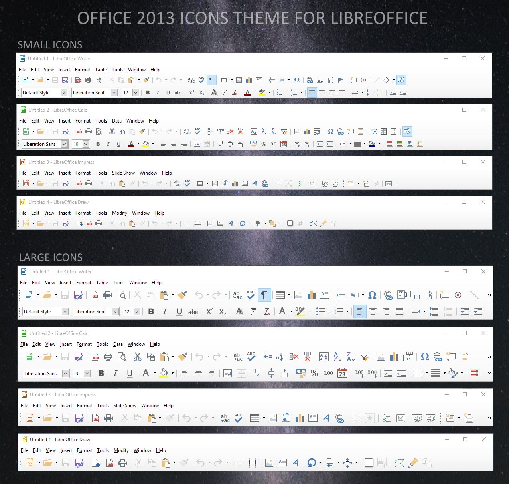

# LibreOffice Personas
A collection of LibreOffice Personas in the Microsoft Office 2016 style

## Usage
Replace default (rubbish) Personas included with LibreOffice @
```C:\Program Files\LibreOffice\share\gallery\personas\```

## Known bugs
- These custom personas will be replaced with the defaults every time you update LibreOffice
- **Because LibreOffice does not support custom themes properly** (I have opened multiple bug reports, see [Readme.txt](Readme.txt):
	- You will need to rename the files from this repository according to the theme files already present.
	- You cannot use all the included custom themes simultaneously.
	- You must destructively replace the original themes.
	- The same theme will apply across all of LibreOffice (e.g. you can't separately colour LibreCalc "Excel-green" and LibreWriter "Word-blue")

## [Office 2013 theme for LibreOffice](https://www.deviantart.com/charliecnr/art/Office-2013-theme-for-LibreOffice-512127527)
by [charliecnr](https://www.deviantart.com/charliecnr) @ DeviantArt, 6 Feb 2015

***Mirrored here to ensure continued access (avoiding DeviantArt account wall) and to put all the M$ Office customisations for LibreOffice in one place***

<!-- {:height="644px" width="614px"} -->


This is an icons theme to make LibreOffice look like Office 2013.

Compatible with LibreOffice versions 4 to 7.

- 06-febr-2015  : first release
- 13-aug-2015  : many icons improved
- 13-febr-2016  : updated for libreoffice 5.1
- 04-aug-2016  : updated for libreoffice 5.2
- 08-febr-2017  : updated for libreoffice 5.3
- 15-sept-2017 : updated for libreoffice 5.4
- 01-febr-2018  : updated for libreoffice 6.0
- 22-aug-2018  : updated for libreoffice 6.1


### HOW TO INSTALL

For LibreOffice 6 and above, download and install the theme as an extension : [https://1drv.ms/u/s!ArgKmgFcmBYHhSQkPfyMZRnXX5LJ](https://1drv.ms/u/s!ArgKmgFcmBYHhSQkPfyMZRnXX5LJ) with `Tools` > `Extension manager`.

The theme packaged as an extension is the easiest way to install (no admin rights needed), only in LibreOffice 6 and above.

Previous versions of LibreOffice don't allow themes as extension, you have to follow those steps :

1. Download (button at top right of this page) and rename zip file to images_office2013.zip and copy it to this folder:
	- Windows:  `C:\Program Files (x86)\LibreOffice 5\share\config\`
    - Linux:  `/usr/lib/libreoffice/share/config/` and `/usr/share/libreoffice/share/config/` or `/opt/libreoffice<version>/share/config/` (use a symlink)
    - OS X:  `LibreOffice/Contents/Resources/config/`

 2. Open LibreOffice, go to `Tools` > `Options` > `LibreOffice` > `View` and change the icon style to Office2013.

 3. Restart LibreOffice.
